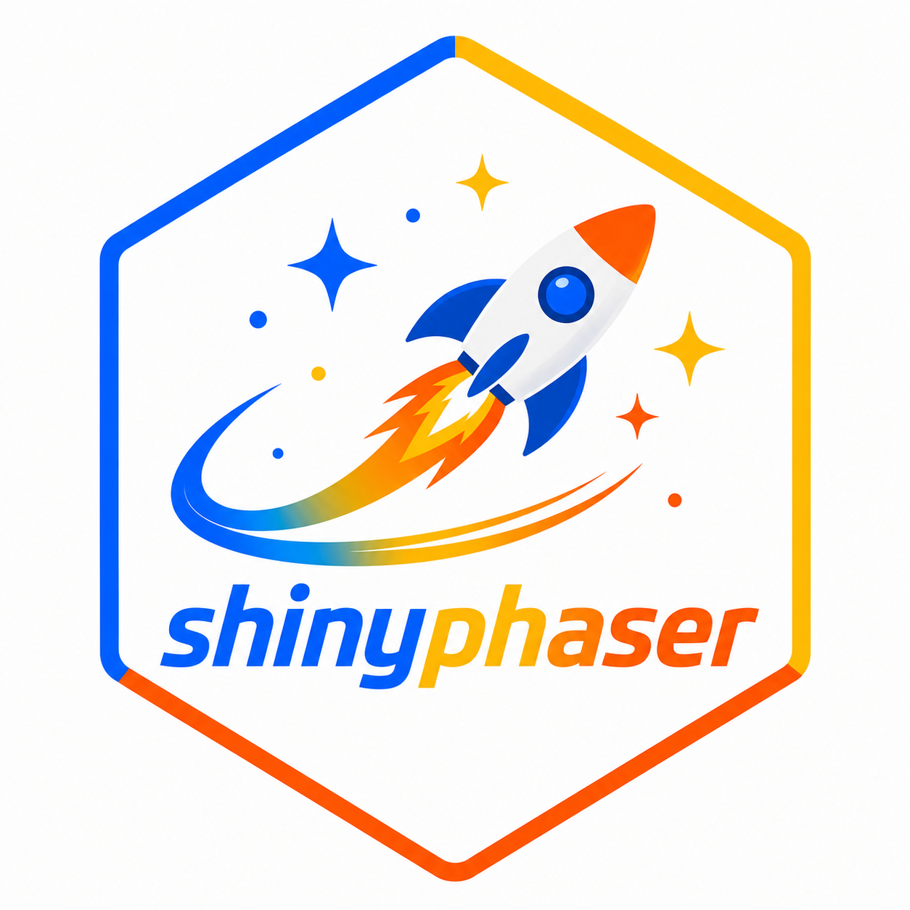
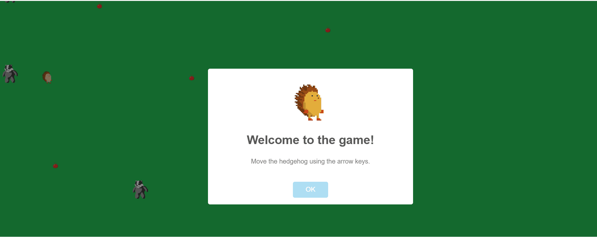

<!-- README.md is generated from README.Rmd. Please edit that file -->

# shinyphaser 

<!-- badges: start -->

[](https://github.com/maciekbanas/shinyphaser/actions/workflows/R-CMD-check.yaml)
[](https://CRAN.R-project.org/package=shinyphaser)
[](https://cran.r-project.org/package=shinyphaser)
<!-- badges: end -->

This package provides an R Shiny interface to selected features of the
[Phaser 3](https://phaser.io/) game framework.

## What you can do with shinyphaser

With the current API, you can build small-to-medium 2D game-like
interactions in Shiny, including:

- 🎮 creating a game canvas in your Shiny UI,
- 🧩 adding images and animated sprites,
- ⌨️ attaching keyboard-based player controls,
- 💥 defining overlap and collision rules between objects,
- 🔔 reacting to game events from R server logic.

## Installation

Install the stable release from CRAN:

``` r
install.packages("shinyphaser")
```

Install the development version from GitHub:

``` r
# install.packages("pak")
pak::pak("maciekbanas/shinyphaser")
```

## Quick start

You can run the built-in sample app:

``` r
shinyphaser::run_sample_app()
```

The development version also includes a small save/load example. Move the bear
with the arrow keys, save, move again, and load to restore both its position and
the R-side score:

``` r
shinyphaser::run_save_load_example()
```

For a compact RPG-style example using a single Wild Forest map:

``` r
shinyphaser::run_simple_rpg()
```

## Learn by example

For a full walkthrough (from static background to movement, animation,
overlap, and collision), see [**Build your first shinyphaser
game**](https://maciekbanas.github.io/shinyphaser/articles/first-game.html)

<!-- -->

## Example games created with `shinyphaser`

- [hedgehog](https://maciekbanas.shinyapps.io/hedgehog)
